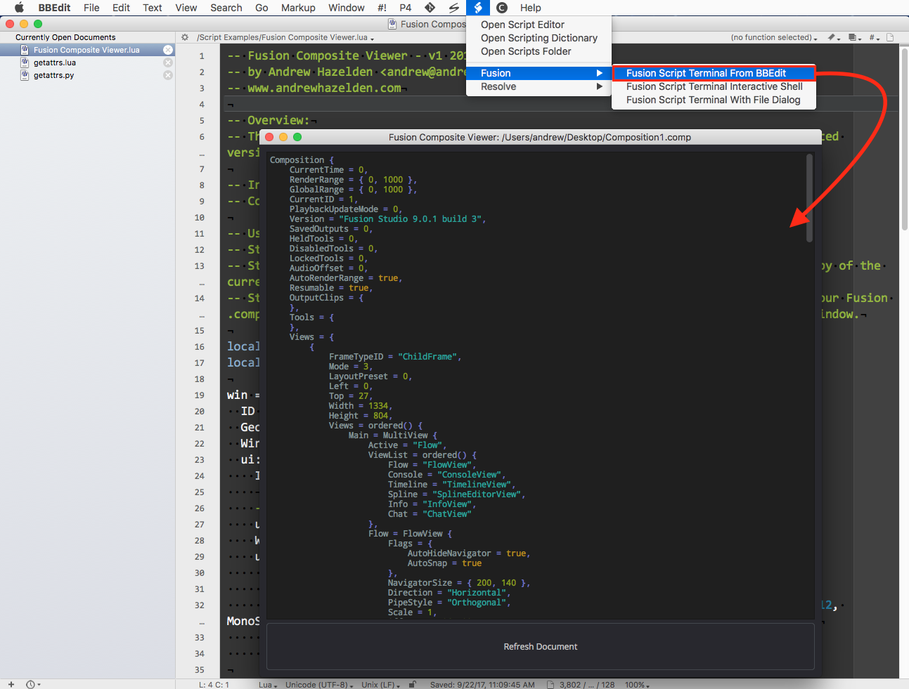
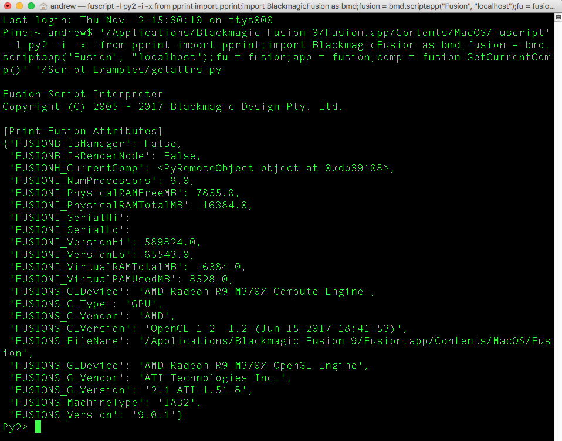
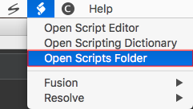
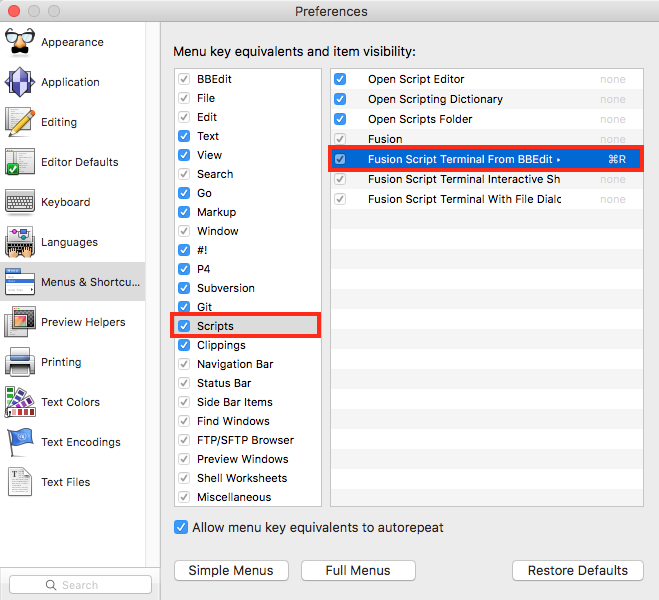
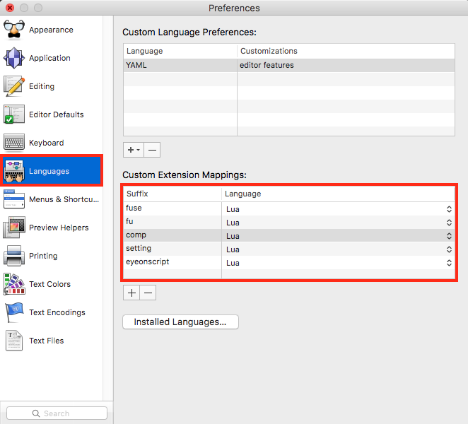
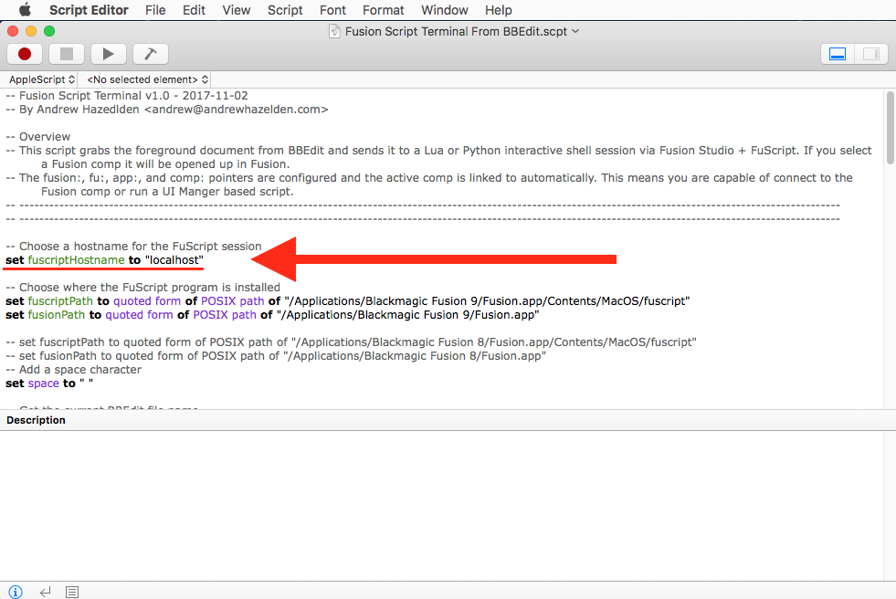

# FuScript Integration for BBEdit on MacOS v2 - 2018-09-14 #

By Andrew Hazelden  
email:  [andrew@andrewhazelden.com](mailto:andrew@andrewhazelden.com)  
web: [www.andrewhazelden.com](http://www.andrewhazelden.com)  

## About the Scripts ##

This project has three AppleScripts that connect BBEdit on MacOS to the Fusion Studio and Resolve Studio via the FuScript command line process. This will free you from the constraints of testing code chunks via the single line entry text field in the Fusion Console tab.

Using this toolset you can now use BBEdit to quickly edit Fusion .lua and .py scripts and run them instantly through the context of the current Fusion composite. If you select a Fusion .comp file it will be opened in a new tab in Fusion. If you select a Fusion macro .setting file it will be added to your current composite.

Fusion Studio or Resolve Studio needs to be running for the FuScript tool to function correctly. The fusion:, fu:, app:, and comp: pointers are configured and the active Fusion comp is linked to automatically. This means you are instantly capable of connecting to the foreground Fusion composite or able to create a Fusion UI Manger based script GUI.

## Screenshot ##

This screenshot shows the result of sending a script from your active BBEdit document editing session to FuScript.

## Included AppleScripts ##

- Fusion
	- Fusion Script Terminal From BBEdit.scpt
	- Fusion Script Terminal Interactive Shell.scpt
	- Fusion Script Terminal With File Dialog.scpt

- Resolve
	- Resolve Script Terminal From BBEdit.scpt
	- Resolve Script Terminal Interactive Shell.scpt
	- Resolve Script Terminal With File Dialog.scpt

## Fusion Script Terminal From BBEdit ##

This script takes the active foreground document that is open in BBEdit and sends it to FuScript as either a .lua, ,py, .py2, or .py3 script. If you have a Fusion .comp open in BBEdit it will be opened up in Fusion's GUI as a normal document.

## Fusion Script Terminal Interactive Shell ##

This script shows a dialog that asks you if you want to to use Python 2, Python 3, or Lua with a FuScript interactive session. If you don't select a scripting language in the dialog after 8 seconds Lua will be chosen as the default language.

After you pick a language in the dialog a new FuScript interactive terminal session is launched in the Terminal.app. You can use this window to paste in and run code that will be executed inside of Fusion's graphical session.

## Fusion Script Terminal With File Dialog ##

This script shows a file dialog that lets you select a .lua, ,py, .py2, or .py3 script. The selected file is then sent to FuScript and executed inside of Fusion's graphical session. If you select a Fusion .comp it will be opened up in Fusion's GUI as a normal document.

## Installation ##

**Step 1.** Open the BBEdit scripts folder by selecting the **Scripts (Icon) > Open Scripts Folder** menu item in BBEdit.

This will open a Finder window and show the contents of this directory:

    $HOME/Library/Application Support/BBEdit/Scripts/

You could also open this folder view up using the Terminal with the following command:

    mkdir -p "$HOME/Library/Application Support/BBEdit/Scripts/"
    open "$HOME/Library/Application Support/BBEdit/Scripts/"

**Step 2.** Unzip the **"FuScript-Integration-for-BBEdit-on-MacOS.zip"** file. Open up the new **"FuScript-Integration-for-BBEdit-on-MacOS"** folder that was created.

**Step 3.** Copy the "Fusion" and "Resolve" folders into the BBedit Scripts folder location you opened in step 1.

**Step 4.** When you switch back to BBEdit open up the **Scripts (Icon) > Fusion >** menu item. You will see the three new AppleScripts.

**Step 5.** If you want FuScript and the BBEdit based AppleScripts to be able to run correctly, you have to make sure the Fusion Studio or Resolve Studio program is running in a graphical session.

## BBEdit Hotkey Customization ##

An optional installation step is to create a custom hotkey in BBEdit's Preferences window. 

This BBEdit hotkey can be used to launch the FuScript integration Applescripts so you can instantly see the results from running your Lua or Python scripts inside of Fusion.

To do this you need to open the BBEdit Preferences. Then Select the "Menus & Shortcuts" section on the left side of the Preferences window. 

You are free to map the BBEdit hotkeys however you want. To do this you need to click in the area on the far right side of a menu item name. This allows you to define a custom hotkey combination.

For my needs, since I am mostly running scripts in BBEdit via the FuScript launching approach I decided to remap the default #! > Run command to use Shift + Command + R:

Then I clicked on the "Scripts" section and set the "Fusion Script Terminal From BBEdit" item to be launched with Command + R. For my needs this makes BBEdit into a really effective IDE Environment.

## BBEdit Languages ##

BBEdit allows you to define custom language mappings for each file type you can open. This is done with the help of the Fusion Preferences "Language" section.

When I am setting up BBEdit I like to map the following Fusion file formats to be displayed with Lua syntax highlighting:

- .fuse
- .fu
- .comp
- .setting
- .eyeonscript

## Remote FuScript Host Access ##

If you are a Fusion based compositing technical director / developer / power user and you want to take these scripts further, you can add a remote system's hostname entry to the variable "fuscriptHostname" in the AppleScripts. This will change the computer that FuScript uses for the Fusion() socket connection. This would let you write code on your local system and test it on a remote computer running a Fusion Studio graphical session. The remote system can be on a different operating system platform which is a handy thing to be able to do.

The "fuscriptHostname" variable is set to "localhost" in the AppleScripts by default which is used to connect to your local computer:

    -- Choose a hostname for the FuScript session
    set fuscriptHostname to "localhost"

As an example, I have a desktop system in my office with a hostname of "Pine". I can change the "fuscriptHostname" variable to use this "Pine"  hostname so I can connect from BBEdit to a remote Fusion compositing system or render node when I am running Lua and Python scripts:

    -- Choose a hostname for the FuScript session
    set fuscriptHostname to "Pine"

## Closing Notes ##

I wrote a pair of Lua and Python based tutorials on the We Suck Less Fusion community forums that explain what FuScript is and how it works:

[Running UI Manager GUIs from a Terminal FuScript Session](https://www.steakunderwater.com/viewtopic.php?f=6&t=1411&start=30#p11498)  

[Running Python Scripts in FuScript](https://www.steakunderwater.com/viewtopic.php?f=6&t=1633&p=11964#p11964)  

Good Luck! I hope you have fun with these AppleScripts and they make you more productive in a day.

Cheers,  
Andrew Hazelden  